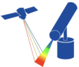

# hypernets_processor
  

The H2020 Hypernets project is developing a new hyperspectral radiometer and integrating it into network automated water and land field sites to make bidirectional reflectance measurements for satellite validation, for more information see the [project website](http://hypernets.eu/from_cms/summary). This python package processes the raw data retrieved from the field to generate the user products.

## Documentation

For more information visit our [documentation](https://hypernets-processor.readthedocs.io/en/latest/).

