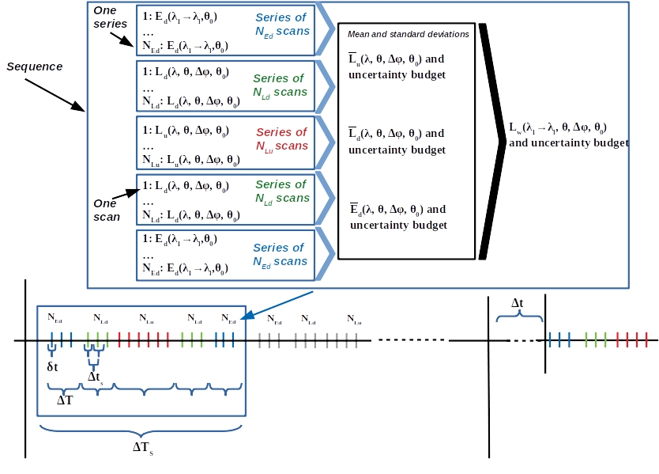

.. reader - algorithm theoretical basis
   Author: seh2
   Email: sam.hunt@npl.co.uk
   Created: 6/11/20

.. _reader:

HYPERNETS Reader - Process to L0
~~~~~~~~~~~~~~~~~~~~~~~~~~~~~~~~

Once the sequence has been completed succesfully, the data arrives on the server with the following data format, name convention and data structure:
   * Sequence directory:
      Data from a single sequence are contained in a SEQUENCE directory with the following name convention *SEQ[date of acquisition with format %Y%m%d]T[time of acquisition with format %H%M%S]*
   * Data structure: The raw data that comes into the sequence directory contains the following files
      * *metadata.txt*:
         1. This files contains a header with PyxisVersion, DateTime, PI, Site Name, Latitude, Longitude, and, SN of the sensor
         2. A full description of the sequence with for each series, the number of scans, the type of measurement (radiance/irradiance), wavelength range (VNIR/SWIR), and, the viewing geometry (relative to the sun, to its park position and the North), followed by the name of the file containing the spectra.
      * *SPE files*:
         File containing the spectra (as mentioned in the metadata file)
      * *meteo.csv*:
         File with the measured relative humidity, light and temperature

Figure XX shows the processing from the raw dataset (in spe-binary datafile format) to
the L0 data product (data_io.hypernets_reader). The main function in this module is  read_sequence.
It calls (1) read_metadata to read the metadata file of the sequence (ASCII file),
(2) read_series to read the different scans concatenated per series in a single spe-binary data file.
According to the metadata file and the filename of the spe-binary file the processing reorders the
scans to L0 radiance, irradiance and black data products.

