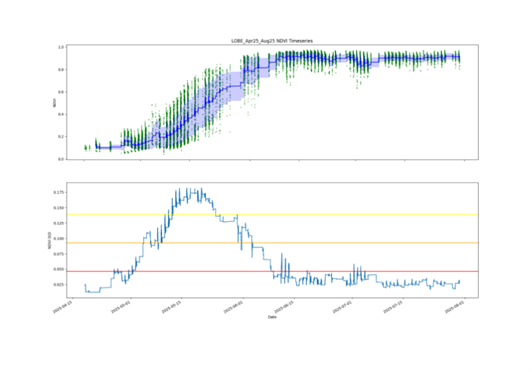
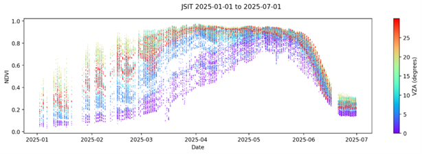
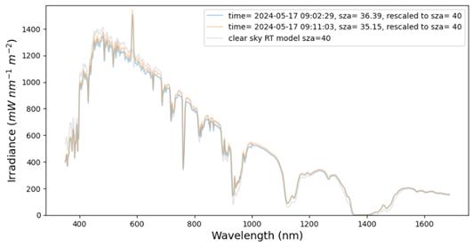
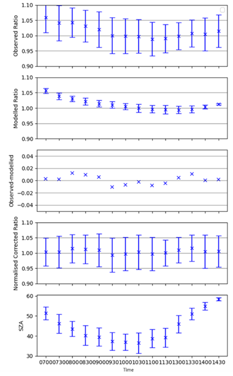
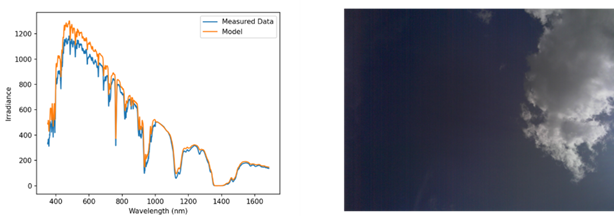
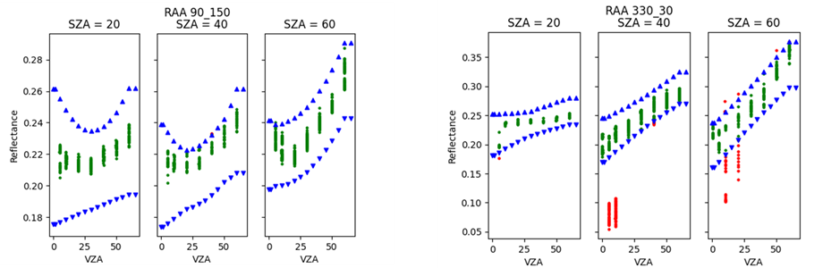

.. quality - algorithm theoretical basis
   Author: pdv
   Email: pieter.de.vis@npl.co.uk
   Created: 07/02/2022

.. _post_processing:

Post Processing - Site-specific Quality Checks
~~~~~~~~~~~~~~~~~~~~~~~~~~~~~~~~~~~~~~~~~~~~~~

The LANDHYPERNET L2A data still contains erroneous sequences which are not 
suitable for Cal/Val, and thus not suitable for public distribution.
The standard L2A processing as described in the previous sections applies general quality checks to the
data. However, no site-specific QC has been applied in the processing to L2A.

To ensure the highest quality of the L2A data over the Cal/Val sites, additional
quality checks are applied to the data. This is done in two stages:
1. An offline analysis is performed for each deployment period at each site, to identify
   periods with known issues (e.g. due to site heterogeneity, bad deployment conditions,
   unsuitable viewing or solar angles, etc). Based on this offline analysis, a range of config
   values are determined for each site and deployment period, which are then stored in the job.config file (see :ref:`config`).
2. During processing to L2B, the site-specific quality checks are applied to the data,
   using the config values determined in the offline analysis. Only data suitable for Cal/Val
   are retained in the L2B data.

Flags Set in the L2A Data
-------------------------

Data flagged in L2A and L1B data are removed, as detailed in the hypernets_processor documentation. 
Specifically, the flags that are filtered out can be found in De Vis et al 2024, or 
https://hypernets-processor.readthedocs.io/en/latest/content/atbd/products/flags.html.

Sequences Outside Any Valid Deployment Date Ranges
--------------------------------------------------

The datetime of the sequence being processed is simply checked against the valid deployment ranges 
(see https://www.landhypernet.org.uk/site_descriptions for these date ranges for each site).

Periods with Bad Deployment Conditions
--------------------------------------

Such date/time/datetime periods can be revealed as part of the offline analysis, or can be known by the site owner 
due to expert knowledge about the site, knowledge about the deployment, etc.

Periods with Site Heterogeneity
-------------------------------

Homogeneous periods are defined using NDVI at vegetated sites. We first define a reference period through manual analysis 
of images from sites and conversations with site owners and calculate the standard deviation of the NDVI in this period. 
The homogeneous periods are then defined as periods where a rolling standard deviation of NDVI is below 1.5 times the reference standard deviation.

   (Top) NDVI timeseries for LOBE April 2025 – August 2025. Green dots show NDVI of a measurement; blue line shows rolling average of 100 measurements with rolling standard deviation as shaded region. (Bottom) Rolling standard deviation of NDVI timeseries; red, orange, and yellow lines show 1, 2, and 3 times the reference standard deviation, respectively, where the reference is defined as the standard deviation of a known homogeneous period (here July 2025).

Unsuitable Viewing Zenith & Azimuth Angle
-----------------------------------------

Such angles with tolerances can be revealed as part of the offline analysis, or can be known by the site owner due to expert site knowledge, knowledge about the deployment, etc. 
To mask out shadows, there is also the option to specify the relative azimuth angle (shadows typically at 0 degrees) and to select all zenith angles smaller than the solar zenith angle.

   NDVI Timeseries for JSIT Jan – Jul 2025 coloured by viewing zenith angle, lower NDVI can be seen close to nadir (0 and 5 degrees).

Unsuitable Sun Zenith Angle
--------------------------

Any measurements with a solar zenith angle above 60 degrees are removed. This value is changed for some high-latitude sites where very low solar zeniths occur; these are defined in offline analysis.

Poorly Performing Wavelength Ranges
-----------------------------------

Wavelength ranges with known issues (such as calibration failures) are masked.

   Clear sky check plot for JSIT irradiance measurements on 2024-05-17 at 9:00 UTC. There is an erroneous peak in the measured irradiance around 585 nm.

A Note on Clear-Sky Modelling
-----------------------------

Site-specific clear sky models are generated using the LibRadtran Radiative Transfer software. The surface was set to be Lambertian with reflectance equal to the mean L2A spectral reflectance for the specific site at a viewing zenith angle of 20 degrees. Atmospheric properties were taken from ERA5 reanalysis data averaged over 2023. One set of models was run with no aerosols, and one set of models was run with the median aerosol optical depth taken from CAMS reanalysis data over the site in 2023. BOA irradiance calculations (including direct and diffuse contributions) were then performed using RT for a range of different solar zenith angles (0 to 80 in steps of 10). The altitude for each simulation was also set specifically from the Copernicus DEM, extracted at each site. During analysis, models are interpolated to the solar zenith angle of the measurements.

Misalignment of the HYPSTAR Sensor
----------------------------------

Sequences with erroneous irradiances were spotted with the likely cause being a slight misalignment of the HYPSTAR sensor to the vertical during the irradiance measurements, causing a trend in the ratio between a clear sky model and the irradiance measurements throughout the day. The observed ratio between the clear sky model with median aerosols (described above) and the irradiance measurements is used to fit a modelled ratio. The modelled ratio has the following free parameters: misalignment viewing zenith angle (the tilt from the vertical); misalignment viewing azimuth angle (the azimuthal direction of the tilt with 0 as North); offset (to account for errors in the clear sky model and drift in the calibration). These free parameters are fit using a Markov Chain Monte Carlo (MCMC) process. The data is then normalised using a correction factor so that the average irradiance is the same as prior to the misalignment correction.

   Illustration of the misalignment modelling results. Data points show data from JAES May-Sep 2023 in bins of time-of-day. Errorbars show standard deviation within the bin. Top: observed ratio of clear sky model and irradiance measurements, which shows some unexpected variability during the day. 2nd panel: modelled ratio, allowing for viewing zenith and azimuth angle to be pointed not exactly at nadir (also includes an offset to account for mismatches between model and observations). 3rd panel: residual between observations and models. 4th panel: normalised corrected ratios (by using the modelled misalignment, but not applying offset). Bottom: solar zenith angle in each bin.

More Stringent Clear Sky Check
------------------------------

The improved clear sky consists of discarding any sequences where the measured irradiances (after correction for misalignment) are either more than 10% higher than the model without aerosols at 550 nm, or more than 10% smaller than the clear sky model with median aerosols. Note that various thresholds and aerosol loads were experimented with, and this combination was found to hold the best trade-off between masking erroneous sequences and wrongfully masking valid sequences.

   Example of cloudy scene from LOBE which passed L2A QC. More stringent L2B site-specific cloud checks correctly identify this as a cloudy scene.

Unsuitable Reflectances for Specific Site
-----------------------------------------

Based on offline analysis, realistic upper and lower bounds on the reflectance values are provided in bins along multiple dimensions (typically solar zenith angle, viewing zenith angle, relative azimuth angle, and optionally temporal bins), to allow for angular variability due to BRDF effects (and optionally seasonal effects). The bounds themselves come from binning the data within these bins, and then iteratively removing outliers (as compared to other values in the bin, as well as fits to the overall angular and temporal variability).

   Illustration of the reflectance bounds for GHNA May 2022 – Oct 2023. The bounds are shown in blue, data which pass in green, and data which are removed in red.

Other Unusual Conditions
------------------------

Any remaining issues, due to unusual conditions that occur occasionally, can be omitted by manually specifying the sequence ID.
