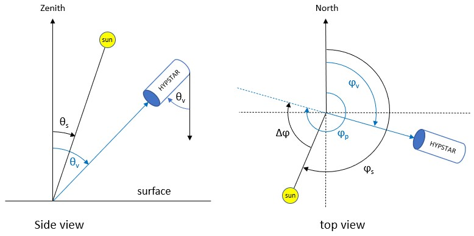
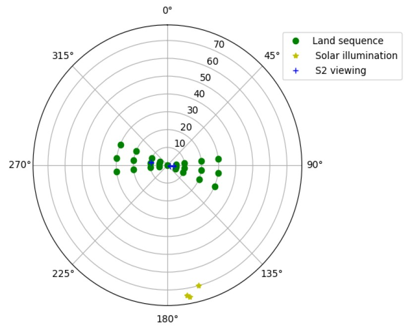

.. data_structure - algorithm theoretical basis
   Author: seh2
   Email: sam.hunt@npl.co.uk
   Created: 6/11/20

.. _data_structure:

Data Structure - Sequences, Series & Scans
~~~~~~~~~~~~~~~~~~~~~~~~~~~~~~~~
The figures bellow illustrate the different terms which are defined as follows:
   * **sequence**: Radiometer measurements are taken in a defined set of geometries called a sequence. For the
      WATERHYPERNET network, the output of a single sequence is the resulting water-leaving reflectance
      (possibly measured at different relative azimuth angles between sun and sensor) and associated uncertainty
      and quality flags. For the LANDHYPERNET network, it is a set of surface reflectance measurements for
      different viewing geometries with associated uncertainties and quality flags.
   * **Series**: Set of acquisitions at each viewing geometry in a sequence. A series is composed of :math:`N_x` repeat measurements
      called scans (which will be averaged).
   * **Scan**: a single radiance or irradiance scan from the target (upwelling radiance) or the sky (downwelling radiance). One scan results in a single unique spectra (with an integration time , see below).
   * **Number of replicates** :math:`N_x` :  Number of replicate scans in a single series allowing to have one measurement (x is :math:`E_d`, :math:`L_u` or :math:`L_d` to denote the number of replicates for downwelling irradiance and upwelling and downwelling radiance, respectively).
      The number of repeat scans in a single series depends on the desired parameter and its
      natural variability, potentially constrained by the total duration and power consumption. For the land XR
      instruments, the SWIR sensors typically have larger integration times than the VNIR sensors (in order to
      reach the same signal-to-noise ratio). Typically, a fixed number (the default is 10) of SWIR scans will be
      set, and the VNIR sensor will keep taking scans until the SWIR sensor has completed its scans (leading to
      a larger number of scans for VNIR than for SWIR).
   * **Integration time of a single scan**: is the time required by a single radiometer to make one hyperspectral scan.
   * **acquisition_time**: time of acquisition, measured in seconds since 1970-01-01.
   * **Viewing zenith angle**: :math:`\theta_v` is the zenith angle of the radiometer (radiance and irradiance). :math:`\theta_v`  = 0° is pointing vertically down, measuring upwelling light. :math:`\theta_v` = 180° is pointing vertically upward, measuring downwelling light. :math:`\theta_v`  ranges from 0 to 180° (see Fig. 3).
   * **Sun zenith angle**: :math:`\theta_s` is the zenith angle of the sun. When the sun is at zenith, :math:`\theta_s` = 0°. At sunset, :math:`\theta_s` = 90° (see Fig. 3) .
   * **Viewing azimuth angle**: :math:`\phi_v` is the angle measured clockwise from North to the direction
      of the sensor (i.e., the line from the target to the sensor; see Figure below). This definition of the viewing azimuth angle
      matches that of most optical satellite geometries (such as those of Sentinel-2, Sentinel-3, Landsat 8).
   * **Pointing-to azimuth angle**: :math:`\phi_p` is measured clockwise from North to the pointing direction (i.e., the line from the sensor to the target, or, :math:`\phi_v+180°`; see Figure below).
   * **Sun azimuth angle**: :math:`\phi_s` is the sun azimuth measured clockwise from North (see Figure below).
   * **Relative azimuth angle**: :math:`\Delta \phi` is the relative azimuth angle between sun and sensor (i.e. :math:`\phi_p`-:math:`\phi_s`). It is measured with respect to sun and clockwise from sun to target (sensor viewing direction). :math:`\Delta \phi` equals 0 means that the radiance sensors are pointing into the sun glint direction. :math:`\Delta \phi` =180° corresponding to viewing with the sun behind. :math:`\Delta \phi` ranges between 0 and 360° (see Fig. 3).

   Left: Side-view diagram defining viewing zenith angles :math:`\theta_v` and solar zenith angles :math:`\theta_s`.
   Right: Top-view diagram defining the viewing azimuth angles :math:`\phi_v`, ‘pointing-to’ azimuth angle :math:`\phi_p` and solar
   azimuth angles :math:`\phi_s`, measured clockwise from North. The relative azimuth angle :math:`\Delta \phi` is defined as the
   difference between :math:`\phi_p` and :math:`\phi_s`. All angles are defined in the reference frame centred on the measurement
   location on the surface.

The figure below illustrates the measurement protocol for a WATERHYPERNET sequence. The current standard
water protocol follows commonly used measurement protocols (Ruddick et al., 2019, and references
therein). Upwelling above-water radiance, :math:`L_u`, series are taken at :math:`\theta_v`=40° and sun-sensor relative azimuths,
:math:`\Delta \phi`, at +/- 90° and/or +/- 135° (to avoid sun glint and high skylight reflectance within the sensor field of
view). Each series of Lu is preceded and followed by a series of above-water downwelling (sky) radiance,
Ld, in the specular reflection direction for the correction of the reflected skylight (i.e., :math:`\theta_v` for :math:`L_u` = 180° -
:math:`\theta_v` for :math:`L_d`). Downwelling irradiance, :math:`E_d`, series are taken at the beginning and the end of each sequence. A
standard water sequence (including only one single azimuth angle) lasts approximately 5 minutes and is
executed every 15 to 30 minutes during daylight.

.. figure:: sequence.jpg
   :scale: 100 %
   :alt: map to buried treasure
   
   Illustration of a scan, a series of scans, and, a sequence for a standard water protocol.

The LANDHYPERNET sequences also start and end with downwelling irradiance series, but have
multiple upwelling radiance series covering a range of different viewing geometries (including a minimum
of five view zenith and six view azimuth angles). The design of the land measurement protocol aims to
optimise the viewing geometry during satellite’s overpass times and by its repeats through the day to obtain
information about Bidirectional Reflectance Distribution Function (BRDF) properties of the site. A plot
illustrating the different viewing geometries for a land sequence is illustrated in Figure 4. Land sequences
do not measure the downwelling (sky) radiance. A standard land sequence typically lasts approximately 15
minutes (depending on illumination) and is executed every 30 minutes during daylight.

WATERHYPERNET and LANDHYPERNET sequences following the above protocols are called
‘standard’ sequences.

   Polar plot showing the typical land protocol viewing geometries for the LANDHYPERNET
   network. As an example, the Sentinel-2 viewing geometries and solar geometries (during Sentinel-2
   overpass) for the NPL Wytham Woods site in January 2022 are shown for comparison.
