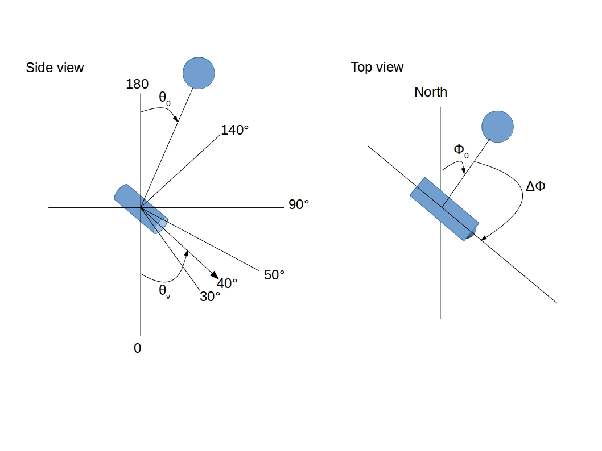
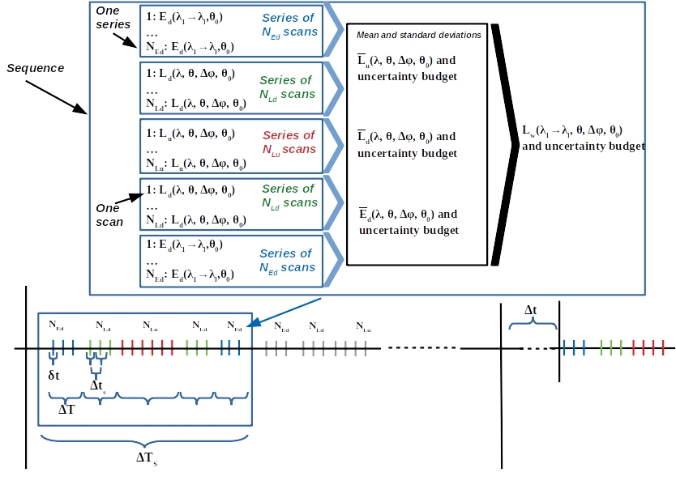

.. data_structure - algorithm theoretical basis
   Author: seh2
   Email: sam.hunt@npl.co.uk
   Created: 6/11/20

.. _data_structure:

Data Structure - Sequences, Series & Scans
~~~~~~~~~~~~~~~~~~~~~~~~~~~~~~~~
The figures bellow illustrate the different terms which are defined as follows:
   * **Scan**: a single radiance or irradiance scan from the target (upwelling radiance) or the sky (downwelling radiance). One scan results in a single unique spectra (with an integration time , see below).
   * **Number of replicates** :math:`N_x` :  Number of replicate scans in a single series allowing to have one measurement (x is :math:`E_d`, :math:`L_u` or :math:`L_d` to denote the number of replicates for downwelling irradiance and upwelling and downwelling radiance, respectively). The number of replicates depends on the expected high frequency variability of the target, potentially constrained by the total duration (and power consumption?) of a measurement sequence. Note that for the land network, N_x can be different for the VNIR and SWIR measurements in the same series as the SWIR measurements take longer than the VNIR (in order to reach the same signal-to-noise). :math:`N_x` must be sufficient to quantify both the desired parameter and its high frequency variability.
   * **Series**: :math:`N_x`-independant radiance or irradiance scans allowing to filter the data and derive an average or median spectrum and its associated standard deviation and natural variability.
   * **Measurement**: median over a series of several scans of downwelling irradiance and upwelling and downwelling radiance, respectively, required for the computation of the water-leaving radiance and reflectance (i.e.,  or  spectrum).
   * **Sequence**: the result of multiple series of target and sky radiance measurements and irradiance measurements. For the water network, the output of a single sequence is the resulting water leaving reflectance and associated uncertainty and quality flags. For the land network, it is a set of surface reflectance measurements for different viewing geometries with associated uncertainties and quality flags.
   * **Viewing zenith angle**: :math:`\theta_v` is the zenith angle of the radiometer (radiance and irradiance). :math:`\theta_v`  = 0° is pointing vertically down, measuring upwelling light. :math:`\theta_v` = 180° is pointing vertically upward, measuring downwelling light. :math:`\theta_v`  ranges from 0 to 180° (see Fig. 3).
   * **Sun zenith angle**: :math:`\theta_s` is the zenith angle of the sun. When the sun is at zenith, :math:`\theta_s` = 0°. At sunset, :math:`\theta_s` = 90° (see Fig. 3) .
   * **Absolute (sun) azimuth angle**: :math:`\phi_s` is the sun azimuth measured clockwise from North (see Fig. 3).
   * **Relative azimuth angle**: :math:`\Delta \phi` is the relative azimuth angle between sun and sensor. It is measured with respect to sun and clockwise from sun to target (sensor viewing direction). :math:`\Delta \phi` equals 0 means that the radiance sensors are pointing into the sun glint direction. :math:`\Delta \phi` =180° corresponding to viewing with the sun behind. :math:`\Delta \phi` ranges between 0 and 360° (see Fig. 3).
   * **Integration time of a single scan**: is the time required by a single radiometer to make one hyperspectral scan.
   *Time variables to be added still!*

   
   Sketch illustrating view/sensor and sun zenith angles ( :math:`\theta_v` and :math:`\theta_s`, respectively) and absolute sun and relative azimuth angles  ( :math:`\phi_s` and :math:`\Delta \phi` , respectively).
   

   
   Illustration of a scan, a series of scans, and, a sequence for a standard water protocol.

