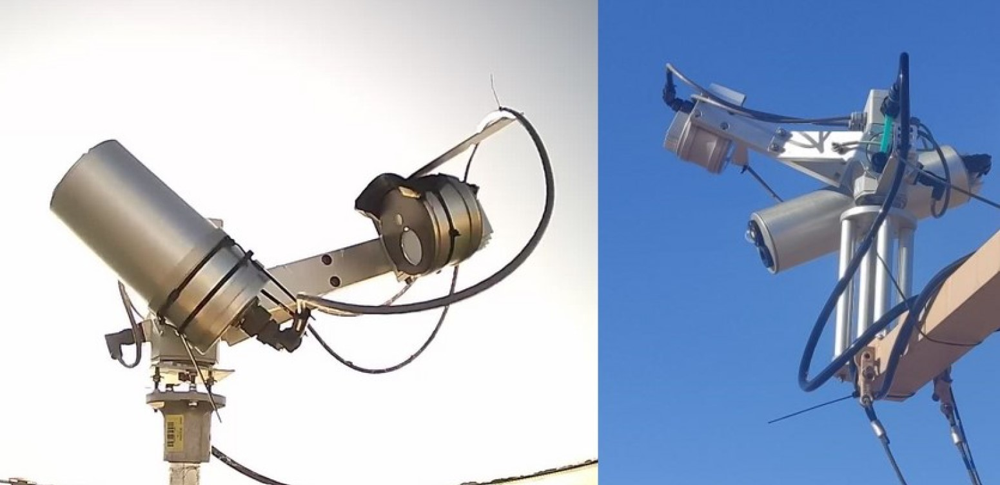

.. hypstar_specs - algorithm theoretical basis
   Author: seh2
   Email: sam.hunt@npl.co.uk
   Created: 6/11/20

.. _hypstar_spec:

HYPSTAR® instrument
~~~~~~~~~~~~~~~~~~~~~~~

HYPSTAR® (HYperspectral Pointable System for Terrestrial and Aquatic Radiometry; `<www.hypstar.eu>`_)
is an autonomous hyperspectral radiometer system dedicated to surface reflectance validation of all optical
Copernicus satellite data products. For a complete description of the HYPSTAR® system, we refer to Kuusk
et al. (in prep). HYPSTAR® takes radiance and irradiance measurements using the same spectrometer
(though with different optical paths for radiance and irradiance). Two slightly different instruments are
used for water and land: (1) The Standard Range (SR) model provides visible and near-infrared (VNIR,
380-1020 nm) data and is used on water sites, (2) the eXtended Range (XR) models have an additional
shortwave-infrared (SWIR) spectrometer module which extends the spectral range up to 1700 nm. The XR
models are meant to be used on the land sites. Pictures of the SR and XR models of the HYPSTAR® are
shown in the Figure below. The instrument characteristics are summarised
in Table 1. For more detailed and up to date information, we refer to `<www.hypstar.eu>`_.

   Picture of the Standard Range (SR) HYPSTAR® system (including validation module) used for
   the WATERHYPERNET network (left) and the eXtended Range (XR) HYPSTAR® system (including
   validation module) used for the LANDHYPERNET network (right).

**Table 1: HYPSTAR Instrument characteristics**
.. csv-table::
   :file: hypstar_specs.csv
   :class: longtable
   :widths: 5 3 3 3
   :header-rows: 1

The spectral sampling of the HYPSTAR® is 0.5 nm in the VNIR and 3 nm in the SWIR, and the
spectral resolution full-width half-maximum (FWHM) is 3 nm in the VNIR and 10 nm in the SWIR. The
SWIR sensor is actively cooled (typically to 0◦C, but this can be configured) to ensure the stability of the
measurements. The field of view of the radiance measurements is ∼ 2◦ for the SR model and ∼ 5◦ for the
XR model. The irradiance measurements observe the full hemisphere, i.e. 180◦. The HYPSTAR® system
is mounted on a low-cost pointing system which allows the acquisition of autonomous, multi-angular
measurements. A GPS, light and rain sensors as well as cameras to image the target and the sensor heads
are also included. Data acquired by the HYPSTAR® is saved in separate binary ‘.spe’ files for each viewing
geometry. These acquisitions are sent to the central server for processing, together with some ‘rgb’ images
taken by the camera within the system, a file with meteorological information (i.e., relative humidity,
temperature and pressure measured within the system and illuminance measured by an external light
sensor), log files made during the acquisition and data transfer, and a metadata file.

The HYPSTAR instruments are calibrated by Tartu University (See Kuusk et al. in prep). Currently
this includes radiometric calibration (gains) and non-linearity calibration (non-linearity coefficients).
Measurements of the temperature responsivity and stray light are also planned/in progress, but these
characterisations are not yet used in the processing of the data in the current processor version. The lab
calibration also includes a wavelength calibration. The wavelengths for each instrument will thus be slightly
different, and the radiance and irradiance measurements can also have slightly different wavelengths
for each spectral pixel (see :ref:`interpolate`). The wavelength calibration assigns a wavelength to each
spectral pixel in the raw data, but not all the raw data pixels will be used in the final product. This is either
because these wavelengths (e.g. in the UV) cannot be calibrated due to the spectral limits of the radiometric
calibration references used, or because these wavelengths are simply too noisy to be used. In the final
publicly distributed data (L2B products) the wavelength range is limited to the ranges specified in Table 1
in order to only supply the user with the best quality data.