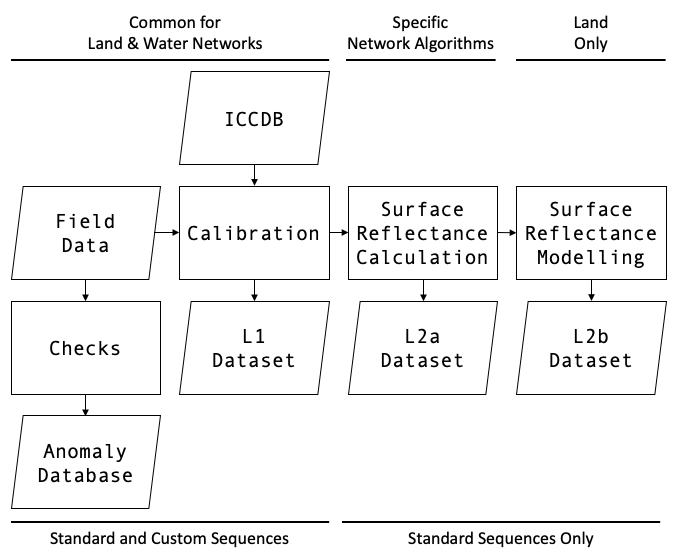
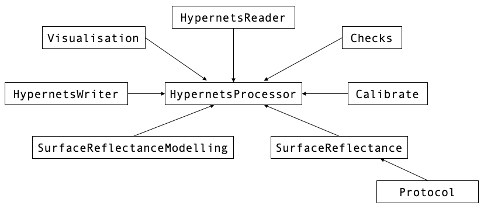

.. software_design - defines design of software
   Author: seh2
   Email: sam.hunt@npl.co.uk
   Created: 23/3/20

.. _software_design:

Software Design
===============

Overview
--------

The following flowchart describes the overall processing flow of the *hypernets_processor*. The processor is divided between functionality required by Land and Water networks, and also standard and custom measurement sequences. More information can be in the :ref:`atbd` section, however to summarise the steps:

* Input is the raw field data and the instrument characterisation and calibration database (ICCDB).
* This data is then calibrated to radiance and irradiance, creating Level 1 files. This performed in the same way for the land and water networks, and for standard and custom measurement sequences.
* Next the calibrated radiometric data is used to determine surface reflectance, creating Level 2a files. This is only performed for standard sequences and uses different algorithms for the land and water network protocols.
* Finally the surface reflectance data is interpolated using a model to produce full day data, creating L2b files. This is only performed for standard-sequence, land-network data.
* Additionally, a series of checks are performed on the data with results populating the Anomalies Database.

Each of the file formats are described in a series of `file format specification documents <https://github.com/HYPERNETS/hypernets_processor/tree/master/docs/file_formats>`_.

Architecture
------------

The high-level architecture of the should be as followed

Class Description
-----------------

TBC

Module Structure
----------------

TBC

Command-Line Interface
----------------------

