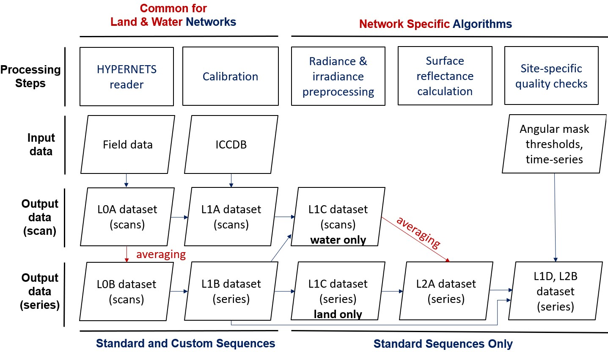

.. software_design - defines design of software
   Author: seh2
   Email: sam.hunt@npl.co.uk
   Created: 23/3/20

.. _software_design:

Software Design
===============

Introduction
------------

The **hypernets_processor** module is a Python software package to process the `Hypernets <http://hypernets.eu/from_cms/summary>`_ Land and Water Network in-situ hyperspectral data to surface reflectance products for distribution to users. This section describes the high-level design of this software.

The **hypernets_processor** has a number of different categories of usage or modes of operation, to provide context to the rest of the design they are initially described here. The first distinction is between the Land Network processor and the Water Network processor:

* **Land Network processor** - processing for data taken by the Hypernets Land Network.
* **Water Network processor** - processing for data taken by the Hypernets Water Network.

Also, there is a distinction between whether the measured data is from a standard measurement sequence or custom measurement sequence:

* **Standard Sequence** - dataset containing the standard set of measurements defined by the Land or Water network.
* **Custom Sequence** - dataset containing any other set of measurements.

Finally, there is the distinction between the two potential use cases, network processing or field use:

* **Network Processing** - automated processing to prepare data retrieved from network sites for distribution to users
* **Field Use** - ad-hoc processing of particular field acquisitions, for example for testing instrument operation in the field

In the main, the processing for each of these use cases will be fairly common, where there is a distinction this is highlighted in the design.

Processing Outline
------------------

The network processing is done centrally on the LANDHYPERNET and WATERHYPERNET servers,
through a command line interface, which continuously checks for new data, and processes it as soon as
it comes in. The hypernets_processor takes the data from acquisition (raw data) to application of
calibration and quality controls, computation of correction factors (e.g. air-water interface reflectance
correction for water processing), temporal interpolation to coincident timestamps, processing to surface
reflectance and averaging per series. A diagram showing the design for the network processing is provided
in the Figure below.

The inputs are the raw field acquisitions and the instrument characterisation and calibration database
(ICCDB). The main outputs are the various L0A-L2B NetCDF datasets listed in :ref:`files`. The
HYPERNETS PROCESSOR also produces various plots and SQL databases of successfully processed
products and anomalies (:ref:`sql`). The different processing steps and the plots produced are described
in the next section. As part of the processing, quality checks are performed which either add quality flags
to the produced data processing, or in some cases raise anomalies and halt the processing. These quality
checks are described in :ref:`quality`. Uncertainties are also propagated through each of the processing steps,
as described in :ref:`uncertainty`. Details on the produced products are provided in :ref:`products`.

Each of the file formats are described in a series of `file format specification documents <https://github.com/HYPERNETS/hypernets_processor/tree/master/docs/file_formats>`_.

Command-Line Interface
----------------------

The software will be run by the user through a command-line interface (CLI).

Module Structure
----------------

The module is structured following standard Python project layout conventions (e.g. `this example <https://github.com/bast/somepackage>`_), as follows:

.. parsed-literal::

   hypernets_processor/
   ├── docs/
   ├── hypernets_processor/
   |   ├── cli/
   |   ├── data_io/
   |   ├── tests/
   |   ├── ...
   |   └── hypernets_processor.py
   ├── ...
   └── setup.py

Where the top level ``hypernets_processor`` directory is the project directory, the sub-directory ``hypernets_processor`` is the package itself. Within the ``hypernets_processor`` package are scripts and subpackages, for example, here we see the ``cli`` subpackage (for the command-line interface code) or the ``data_io`` subpackage (that contains data readers and writers). Tests for packages and subpackages should go in a separate ``tests`` subpackage. Documentation (such as this Sphinx generated documentation) belongs in the ``docs`` directory. The ``setup.py`` script tells the installer how to install the package.

